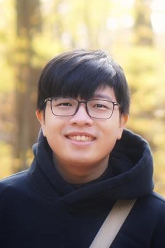
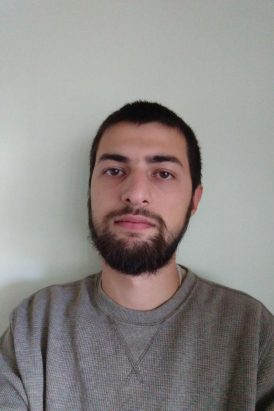
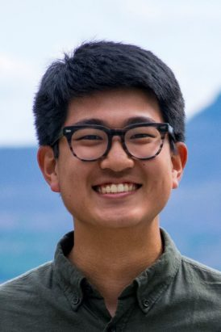
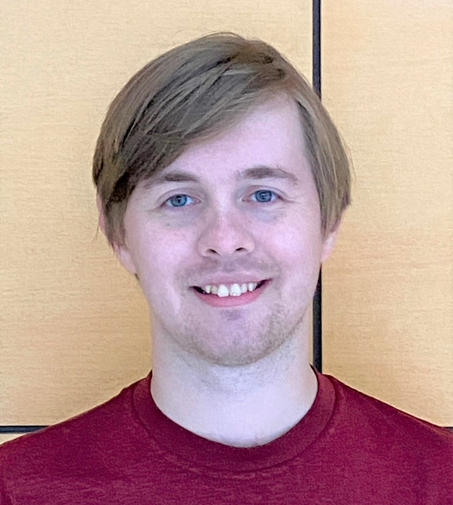
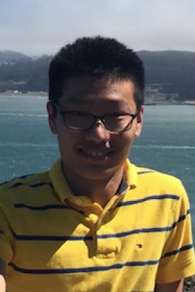

To paraphrase [a former mentor](https://en.wikipedia.org/wiki/David_Patterson_(computer_scientist)), "in academia, good graduate students are the coin of the realm." I have had the immense fortune to work with these fantastic students and postdocs, and am always looking to add more talented and hard-working students to my group.

#### Current

<a href="https://dodat619.github.io/">

Dat Do</a> (2023–)

Enes Dilber (2018–)

#### Former

Caleb Ki (2017–2022). Off to Lyft as a data scientist.

<a href="https://sites.google.com/umich.edu/blegried/home">

Brandon Legried</a> (postdoctoral scholar; 2020–2022). Now at Georgia Tech.

Yifan Jin (2017–2022).

