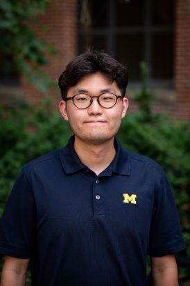
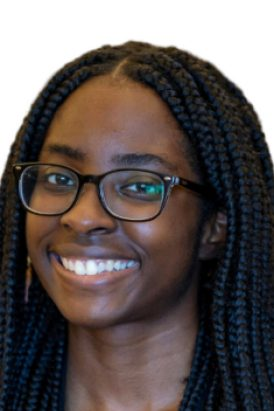
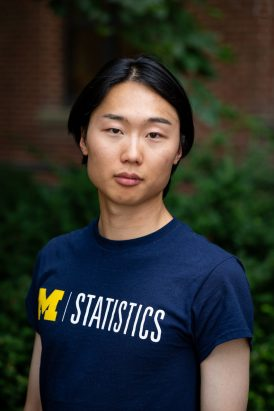
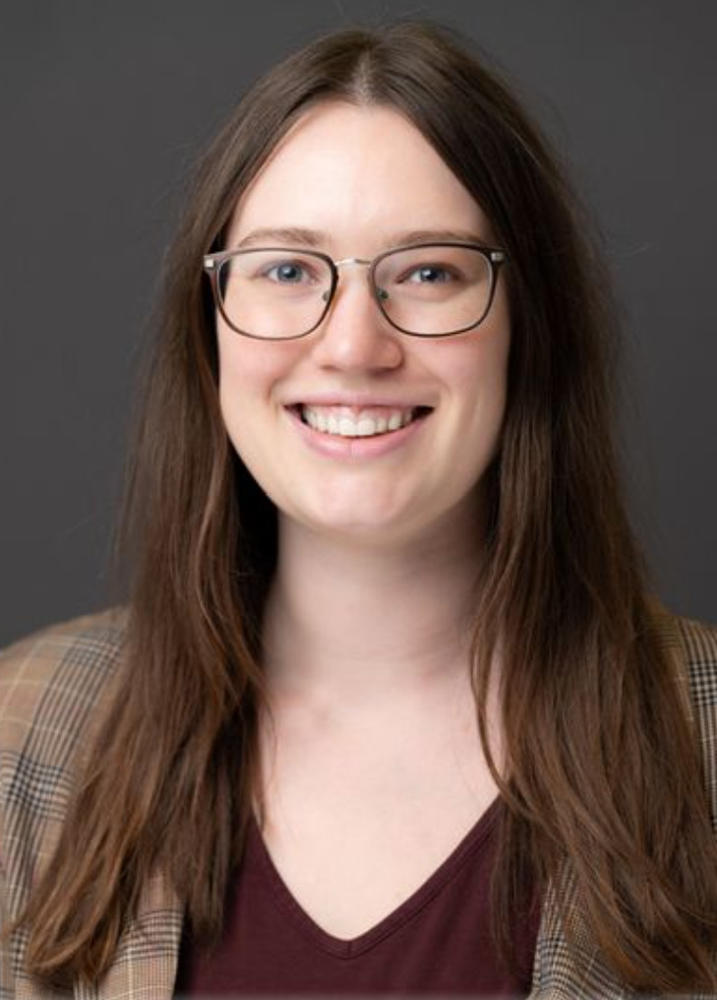
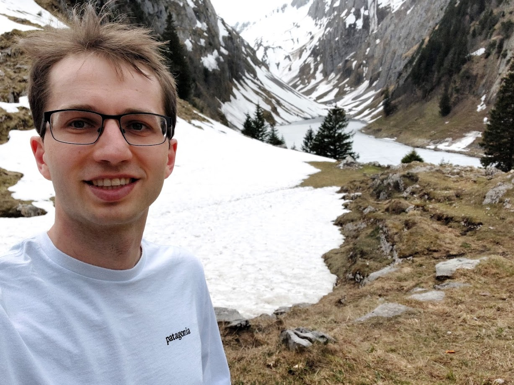
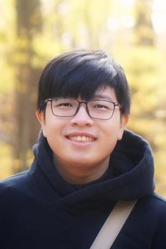
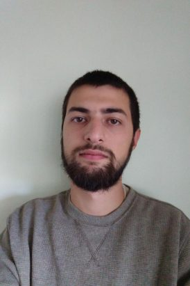
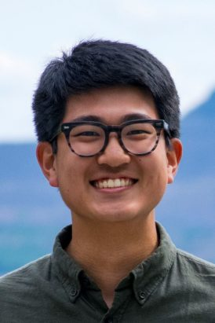
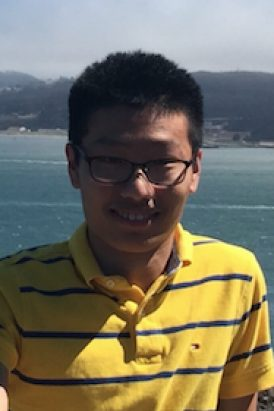

To paraphrase [a former mentor](https://en.wikipedia.org/wiki/David_Patterson_(computer_scientist)), "in academia, good graduate students are the coin of the realm." I have had the immense fortune to work with these fantastic students and postdocs, and am always looking to add more talented and hard-working students to my group.

#### Current

Jiatong (Kevin) Liang (2024–)

Alexis Edozie (2024–)

<a href="https://hanbin973.github.io">

Hanbin Lee</a> (2025-).

<a href="https://hfr1tz3.github.io">

Hallie Fritze</a> (postdoctoral scholar; 2025-).

<a href="https://sdtemple.github.io">

Seth Temple</a> (Schmidt AI fellow; 2025-).

#### Former

<a href="https://dodat619.github.io/">

Dat Do</a> (2023–2025). Currently University of Chicago as a Kruskal Instructor in the Department of Statistics.

Enes Dilber (2018–2023). Off to Wayfair as a data scientist.

Caleb Ki (2017–2022). Off to Lyft as a data scientist.

<a href="https://sites.google.com/umich.edu/blegried/home">

Brandon Legried</a> (postdoctoral scholar; 2020–2022). Now at Georgia Tech.

Yifan Jin (2017–2022).

